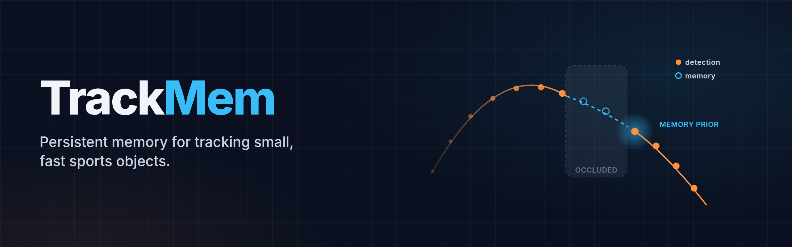

# TrackMem



**A tracker with persistent memory for small, fast sports objects: shuttlecocks, footballs, cricket balls, tennis balls.**

TrackMem builds on the TrackNet line of heatmap trackers. Each TrackNet model looks at a short window of frames and forgets everything once the window moves on. TrackMem carries a small learned memory of the object's motion from frame to frame and feeds it back into detection. This helps most where single windows struggle: blur, occlusion, fast direction changes, and the object leaving and re-entering the frame.

Nothing in the model is specific to one sport. It learns from frame-level (x, y, visibility) labels and works at any frame rate.

It is written in PyTorch and trained from scratch. The first benchmark is badminton (TrackNetV2 dataset); other sports are planned.

Trained checkpoints will be released soon.

## Results

These are results on the held-out Test matches of the TrackNetV2 dataset (3 matches, 12,656 frames). A prediction counts as correct if it is within 4 px of the label at the original 1280×720 resolution. Both models were trained with the same recipe, data split and number of epochs.

| Model | F1 | Precision | Recall | Median error |
|---|---|---|---|---|
| TrackNetV5 (our retrain) | 0.915 | 0.887 | 0.945 | 2.00 px |
| **TrackMem** | **0.931** | **0.907** | **0.957** | **1.65 px** |
| TrackMem, memory cleared every frame | 0.923 | 0.920 | 0.927 | 1.64 px |

F1 by scenario:

| Model | Normal | Fast | Hit | Reappearing |
|---|---|---|---|---|
| TrackNetV5 (our retrain) | 0.941 | 0.877 | 0.914 | 0.837 |
| **TrackMem** | **0.959** | **0.892** | **0.922** | **0.845** |

Notes:
- **Single seed.** Each model has one training run.
- **Detection threshold.** TrackMem uses 0.15 on P(visible) × heatmap peak, tuned on the validation matches only.
- **Other metric.** With the 4 px tolerance measured at 512×288 instead, as in the official TrackNetV5 code, TrackNetV5 scores 0.959 and TrackMem 0.953.
- **Comparing with published TrackNet numbers.** Papers in the series use different splits, tolerances and resolutions. For example, reported TrackNetV2 F1 on this dataset ranges from 0.91 to 0.97. So we only compare against models we retrain under one protocol, not against published figures.

## How TrackMem differs from the TrackNet family

| | Input | Temporal model | State across windows | Visibility | Sub-pixel |
|---|---|---|---|---|---|
| [TrackNet](https://arxiv.org/abs/1907.03698) | 1 or 3 frames | VGG16 + deconv, multi-in single-out | – | heatmap threshold | – |
| [TrackNetV2](https://paperswithcode.com/paper/tracknetv2-efficient-shuttlecock-tracking) | 3 frames | U-Net, multi-in multi-out | – | heatmap threshold | – |
| [TrackNetV3](https://dl.acm.org/doi/10.1145/3595916.3626370) | 8 frames + background | U-Net + offline trajectory inpainting | offline post-processing | heatmap threshold | – |
| [TrackNetV4](https://arxiv.org/abs/2409.14543) | 3 frames | motion attention maps | – | heatmap threshold | – |
| [TrackNetV5](https://arxiv.org/abs/2512.02789) | 3 frames | motion direction maps + transformer refinement (R-STR) | – | heatmap threshold | – |
| **TrackMem** | 3 frames | motion maps + refinement + learned kinematic memory with feedback | **online, whole rally** | **learned head** | **offset head** |

What the memory adds:
- **Persistent state.** The memory stores position, velocity, acceleration, uncertainty, confidence and a learned latent vector (GRU). It is carried frame to frame across the whole rally. It works online and does not use offline post-processing.
- **Feedback into detection.** Each frame, the memory predicts where the object should be and adds that as a Gaussian prior to the detector's features.
- **Self-correction.** The memory updates from a separate prior-free evidence map. A wrong prediction therefore cannot confirm itself.
- **Mixed frame rates.** Motion is integrated with the real time step, so the memory handles the dataset's mix of 25, 29.97 and 30 fps clips.
- **Visibility head.** Visibility is a learned output that uses the memory's speed and confidence. For example, a ball or shuttle lying still before a serve or after a rally is reported as not in play.
- **Size.** TrackMem has 14.85M parameters in total. The memory and its heads account for about 80k of them.

The motion maps and R-STR refinement are adopted from [TrackNetV5](https://arxiv.org/abs/2512.02789).

```
3 frames → motion maps → U-Net → features ─┬→ evidence map ─────────────→ memory update
                                            │                                   │
                memory prior (Gaussians) ───┤◄──────────────────────────────────┘
                                            └→ fusion → R-STR → heatmap
                                               features → offset head (sub-pixel x, y)
                                               features + memory cues → visibility head
```

Training is recurrent. Each sample is a sequence of 8 consecutive steps with the memory in the loop. Sequences start from noisy, empty or deliberately wrong memories, and the prior is randomly hidden, so the detector never learns to rely on the memory alone.

## Setup

```bash
pip install -r requirements.txt
```

Download the [Shuttlecock Trajectory Dataset](https://hackmd.io/@TUIK/rJkRW54cU) (TrackNetV2) and unzip it to `data/TracknetV2/{Professional,Amateur,Test}`. Then decode the videos once into 512×288 frame arrays (about 40 GB):

```bash
python tools/extract_frames.py --root data/TracknetV2 --out data/cache/frames_512x288
```

## Train and evaluate

```bash
python train.py --model trackmem                 # TrackMem
python train.py --model trackmem --resume runs/trackmem/last.pt

python evaluate.py --ckpt runs/trackmem/best.pt --split test --set eval.threshold=0.15
python evaluate.py --ckpt runs/trackmem/best.pt --split test --set eval.memory_mode=reset eval.threshold=0.15  # ablation
```

Settings live in `config.yaml`, and any of them can be overridden with `--set key=value`.

Evaluation reports F1, precision, recall and localization error at 4 px, in both 1280×720 and 512×288 space. Results are given overall and per scenario: normal, fast, hit, reappearing, short and long occlusion, out of frame, and rally start/end. Per-frame predictions are written to `eval_<split>/frames.csv`.

## Annotated video

```bash
python inference.py --ckpt runs/trackmem/best.pt --set eval.threshold=0.15          # first Test rally
python inference.py --ckpt runs/trackmem/best.pt --video match.mp4 --out outputs/match_pred.mp4
```

The output video shows:
- the model's detection (red) and its trail;
- the ground truth (green), when a dataset CSV exists;
- a per-frame label against the ground truth: OK, MISS, FP or OFF.

A CSV of predictions is also written, in the dataset's label format.

## Colab

[Open the training notebook](https://colab.research.google.com/github/panditamey/TrackMem/blob/main/colab/train.ipynb). It needs `MyDrive/TrackNetDataset/TrackNetV2.zip` in Google Drive. Set `MODEL` and `EXP` (the run folder name) in the first cell.

## Status

This is ongoing research. Planned next steps:
- training and evaluation on other sports (football, cricket, tennis);
- multi-seed runs;
- averaging overlapping windows at evaluation for both models;
- longer training sequences, so the memory learns to carry the object through long gaps.
